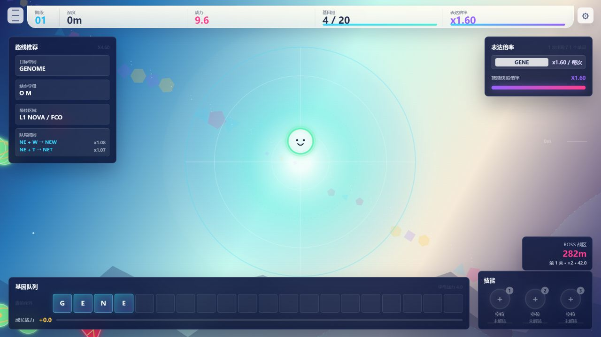
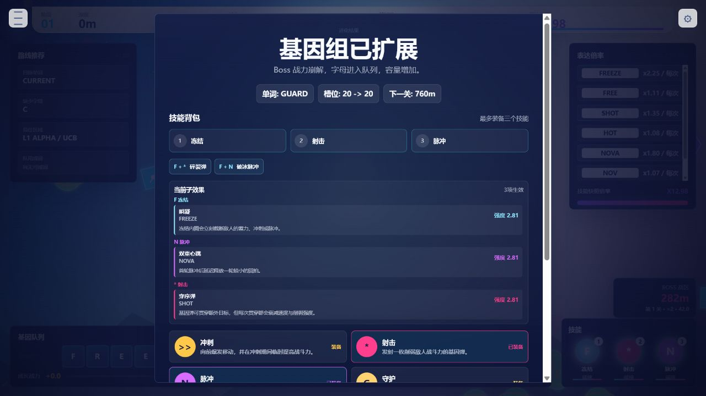
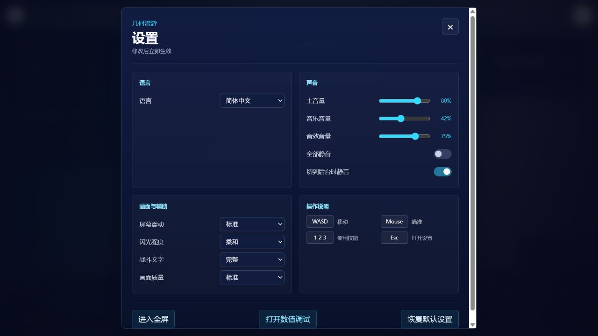

# 几何潜游：吞噬与进化

《几何潜游：吞噬与进化》是一款正在开发中的浏览器动作游戏原型。游戏保留了“大鱼吃小鱼”中体型与战斗力的直观关系，同时把字母收集、单词构筑和主动技能组合加入下潜流程。

项目使用原生 HTML、CSS 与 JavaScript 编写，不依赖 Unity、npm 或构建工具。

## 游戏截图

### 下潜与战斗



### 技能背包与组合效果



### 中文设置界面



## 核心玩法

玩家控制一条几何鱼向深处移动，吞噬较弱的生物、收集字母并调整自己的基因序列。体型会随战斗力变化，因此通常可以直接从视觉上判断敌我差距；少数特殊敌人会故意打破这种对应关系。

当前基因组最多容纳 20 个字母。新字母从队尾进入，容量已满时，最前方的字母会被挤出。玩家需要在有限长度内同时考虑基础战力、单词倍率、技能来源和即将离开序列的字母。

### 无限重叠单词

词库目前包含 3,104 个英文单词。所有连续命中都会参与结算，允许无限重叠、包含与重复，不设置重复收益递减，也不限制一次基因表达的单词数量。

例如 `warear` 会同时识别：

- `ware`
- `war`
- `area`
- `are`
- `ear`

同一个单词在序列中出现多次时，每次出现都会独立贡献倍率。

### 战斗力

战斗力由字母、单词、成长战力和临时效果共同决定：

```text
战斗力 = ((基础战力 + 字母战力) × 全部单词倍率 + 成长战力) × 临时倍率
```

- 字母鱼会提供新的基因字母。
- 成长鱼不提供字母，而是增加固定成长战力。
- 敌方攻击会先削减成长战力，储备耗尽后再破坏基因组。
- 成长战力与基因组都耗尽后再次受到有效攻击，本轮游戏结束。

## 技能体系

当前版本包含 10 个技能家族、100 个词驱动技能效果，其中 2,278 个词已经归入技能体系。

基础技能家族包括：

| 技能 | 主要作用 |
| --- | --- |
| 冲刺 | 快速移动，并在冲刺期间临时提高战斗力与体型 |
| 射击 | 发射基因弹，远程削弱目标战斗力 |
| 脉冲 | 对周围多个敌人造成范围削弱 |
| 守护 | 抵挡下一次会损伤成长战力或基因组的攻击 |
| 冻结 | 大范围减速敌人并中断部分攻击行为 |
| 扫描 | 显示敌人的类型、战斗力、字母与奖励 |
| 生长 | 强化接下来数次吞噬成长鱼的收益 |
| 剪接 | 调整未锁定基因因子在序列中的位置 |
| 回响 | 临时重复当前最强单词的倍率 |
| 侵蚀 | 按比例削减强敌或 Boss 的战斗力 |

玩家最多同时装备三个技能。技能由当前基因组中的对应单词实时供能：如果相关单词被挤出，技能仍会保留在装备槽中，但会暂时失去效果；重新组成对应单词后即可恢复。

不同技能之间存在组合效果，例如冻结与射击可以形成“碎裂弹”，冻结与脉冲可以形成“破冰脉冲”。技能背包会显示当前装备、来源词、重复次数、效果强度、子效果与断电状态。

## 敌人与生态

敌人的战斗力由所在层级和区域危险度决定，不会跟随玩家战力动态缩放。

- **成长鱼**：数量最多、攻击性低，只提供固定成长战力。
- **字母鱼**：携带基因字母，扫描后才能看见具体掉落。
- **猎手**：平时移动较慢，接近后停顿并进行高速长距离冲刺。
- **射手**：保持距离，预判玩家移动后发射投射物。
- **干扰者**：蓄力后释放逐渐扩张的范围脉冲。
- **珍稀守卫**：活动范围有限，战斗力显著高于同区域普通敌人，并提供额外奖励。

部分成长鱼会组成鱼群，并由猎手或干扰者守护。守卫只会在玩家进入鱼群危险范围后离开队形追击。

## 关卡

当前流程包含四层下潜区域与四场 Boss 战。Boss 的目标战力以装满 20 槽后的参考战力为基础，依次约为 `2×`、`4×`、`8×` 和 `16×`。

玩家需要依靠单词倍率、成长战力与技能削弱突破数值门槛。击败 Boss 后会确认当前表达、获得奖励并打开技能背包，随后可以调整三槽构筑再进入下一层。

## 操作

| 按键 | 功能 |
| --- | --- |
| `WASD` / 方向键 | 移动 |
| 鼠标 | 瞄准 |
| `1` / `2` / `3` | 使用对应装备槽的技能 |
| `Space` / `Shift` | 使用已装备的冲刺 |
| `J` / 鼠标左键 | 使用已装备的射击 |
| `K` / 鼠标右键 | 使用已装备的扫描 |
| `Esc` | 打开设置 |

## 运行方式

直接使用浏览器打开 `index.html` 即可运行。

也可以在项目目录启动本地静态服务器：

```powershell
python -m http.server 4173 --bind 127.0.0.1
```

然后访问：

```text
http://127.0.0.1:4173/index.html
```

`tuning.html` 是独立的数值调试页面，可修改敌人、成长鱼、体型与 Boss 参考值。设置会保存在浏览器本地，不会修改源码。

## 设置与辅助功能

设置面板目前支持：

- 简体中文与英文切换
- 主音量、音乐音量和音效音量
- 全部静音与切到后台时静音
- 屏幕震动、闪光强度和战斗文字
- 性能、标准和高画质模式
- 全屏切换与恢复默认设置

当前音乐为临时程序化循环，后续可以替换为正式配乐而不影响游戏规则。

## 测试

测试文件均为可直接运行的 Node.js 脚本：

```powershell
Get-ChildItem tests/*.test.js | ForEach-Object { node $_.FullName }
```

当前覆盖内容包括单词重叠、基因溢出、Boss 数值、扫描隐私、三槽技能、技能组合、100 个效果目录及四批效果行为。

## 项目结构

```text
index.html              游戏入口
styles.css              界面样式
tuning.html             数值调试页面
src/core/               配置、状态与通用工具
src/data/               词库与技能词映射
src/systems/            战斗、敌人、基因、单词、渲染等系统
src/skills/             基础技能与四批扩展效果
src/ui/                 HUD、提示与 Boss 奖励界面
tests/                  独立测试脚本
docs/screenshots/       README 使用的实际游戏截图
```

当前版本仍是用于验证核心玩法与构筑深度的浏览器原型，视觉表现、数值节奏、技能细分和正式音频仍会继续调整。
